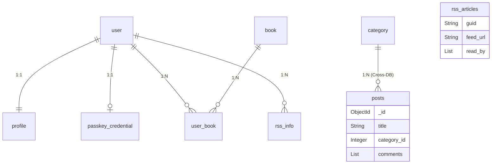

# ReadingList 数据模型文档

本文档描述 ReadingList 的多数据库结构：PostgreSQL 负责强一致的核心业务数据，MongoDB 负责文档型内容，Redis 负责缓存与短期状态。

## 1. 数据库概览

- **PostgreSQL**：用户、书籍、分类、访客追踪、RSS 配置、Passkey 凭证等结构化数据
- **MongoDB**：博客文章、留言板、RSS 抓取内容等文档型数据
- **Redis**：缓存、验证码、会话、任务中间态、临时计数

## 2. PostgreSQL 表结构

### 2.1 user - 用户表
存储用户核心账号信息。

| 字段名 | 类型 | 约束 | 说明 |
| :--- | :--- | :--- | :--- |
| id | Integer | PK, Autoincrement | 用户唯一标识 |
| github_id | Integer | Unique, Nullable | GitHub OAuth ID |
| name | String(50) | Index | 用户显示名称 |
| username | String(50) | Unique, Not Null | 登录用户名 |
| password_hash | String(200) | Not Null | 加密存储的密码 |
| last_login_at | DateTime | Nullable | 上次登录时间 |
| current_login_at | DateTime | Nullable | 本次登录时间 |
| last_login_ip | String(100) | Nullable | 上次登录 IP |
| current_login_ip | String(100) | Nullable | 本次登录 IP |
| login_count | Integer | Default: 0 | 登录总次数 |
| active | Boolean | Default: False | 账号激活状态 |

### 2.2 profile - 用户资料表
存储用户详细资料（与 user 表一对一关联）。

| 字段名 | 类型 | 约束 | 说明 |
| :--- | :--- | :--- | :--- |
| id | Integer | PK, Autoincrement | 资料唯一标识 |
| email | String(100) | Unique, Nullable | 电子邮箱 |
| gender | String(10) | Nullable | 性别 |
| mobile | String(15) | Nullable | 手机号 |
| photo | String(200) | Default: 'default.png' | 头像路径 |
| user_id | Integer | FK(user.id), Unique | 关联用户 ID |

### 2.3 book - 书籍表
存储书籍基础元数据。

| 字段名 | 类型 | 约束 | 说明 |
| :--- | :--- | :--- | :--- |
| id | Integer | PK, Autoincrement | 书籍唯一标识 |
| title | String(200) | Index, Not Null | 书名 |
| author | String(60) | Index, Not Null | 作者 |
| bookid | String(50) | Unique, Nullable | 外部系统 ID (如微信读书) |
| cover | String(200) | Nullable | 封面图片 URL |

### 2.4 user_book - 用户-书籍关联表
存储用户书架信息（多对多关联）。

| 字段名 | 类型 | 约束 | 说明 |
| :--- | :--- | :--- | :--- |
| user_id | Integer | PK, FK(user.id) | 用户 ID |
| book_id | Integer | PK, FK(book.id) | 书籍 ID |
| iscompleted | Boolean | Default: False | 是否阅读完成 |
| add_date | DateTime | Index, Default: Now | 添加到书架时间 |
| update_date | DateTime | Index, OnUpdate: Now | 最后更新时间 |

### 2.5 category - 分类表
博客文章分类。

| 字段名 | 类型 | 约束 | 说明 |
| :--- | :--- | :--- | :--- |
| id | Integer | PK, Autoincrement | 分类唯一标识 |
| name | String(50) | Unique, Not Null | 分类名称 |

### 2.6 visitor_track - 访客追踪表
记录站点访问记录。

| 字段名 | 类型 | 约束 | 说明 |
| :--- | :--- | :--- | :--- |
| id | Integer | PK, Autoincrement | 记录 ID |
| visitor_id | String(100) | Index | 访客唯一指纹 |
| page_url | String(200) | Not Null | 访问全路径 |
| page_path | String(200) | Not Null | 页面路径 |
| referrer | String(200) | Nullable | 来源页面 |
| browser | Text | Not Null | User Agent 原文字符串 |
| screen_resolution | String(100) | | 屏幕分辨率 |
| language | String(50) | | 浏览器语言 |
| ip_address | String(100) | Index | 访客 IP |
| visit_time | DateTime | Index, Default: Now | 访问时间 |
| browser_name | String(100) | Nullable | 浏览器名称解析结果 |
| browser_version | String(100) | Nullable | 浏览器版本 |
| os_name | String(100) | Nullable | 操作系统 |
| os_version | String(100) | Nullable | 系统版本 |
| cpu | String(50) | Nullable | CPU 架构 |
| device_type | String(50) | Nullable | 设备类型 (Mobile/PC) |

### 2.7 rss_info - RSS 订阅表
存储用户的 RSS 订阅源信息。

| 字段名 | 类型 | 约束 | 说明 |
| :--- | :--- | :--- | :--- |
| id | Integer | PK, Autoincrement | 记录 ID |
| rss_url | String(200) | Index, Not Null | RSS XML 链接 |
| feed_title | String(255) | Nullable | 订阅源名称 |
| feed_link | String(500) | Nullable | 站点主页链接 |
| feed_description | Text | Nullable | 描述 |
| feed_published_at | DateTime | Nullable | 源更新时间 |
| entry_count | Integer | Default: 0 | 文章计数 |
| last_fetched_at | DateTime | Nullable | 上次抓取时间 |
| created_at | DateTime | Index, Default: Now | 创建时间 |
| updated_at | DateTime | OnUpdate: Now | 更新时间 |
| user_id | Integer | FK(user.id), Index | 所属用户 |

### 2.8 passkey_credential - Passkey 凭证表
支持 WebAuthn 登录的凭证信息。

| 字段名 | 类型 | 约束 | 说明 |
| :--- | :--- | :--- | :--- |
| id | Integer | PK, Autoincrement | 记录 ID |
| credential_id | String(255) | Unique, Not Null | 凭证 ID |
| public_key | String(500) | Not Null | 公钥数据 |
| sign_count | Integer | Default: 0 | 签名计数器 |
| created_at | DateTime | Index, Default: Now | 创建时间 |
| user_id | Integer | FK(user.id), Index | 所属用户 |

## 3. MongoDB 集合结构

### 3.1 posts - 博客文章
集合名: `posts`。支持内嵌评论。

| 字段名 | 类型 | 说明 |
| :--- | :--- | :--- |
| _id | PydanticObjectId | 唯一标识 |
| title | str | 文章标题 |
| body | str | 正文内容 (Markdown/HTML) |
| category_id | int | 关联 PostgreSQL 的分类 ID |
| is_pinned | int | 是否置顶 (0: 否, 1: 是) |
| likes | int | 点赞数 |
| comments | list[Comment] | 内嵌评论列表 (结构见下文) |
| created_at | datetime | 创建时间 |
| updated_at | datetime | 更新时间 |

**Comment (内嵌模型):**
- author, body, email, site, from_admin, created_at, reviewed

### 3.2 message_board - 留言板
集合名: `message_board`。

| 字段名 | 类型 | 说明 |
| :--- | :--- | :--- |
| _id | PydanticObjectId | 唯一标识 |
| name | str (Indexed) | 留言者名称 |
| message | str (Indexed) | 留言内容 |
| review | int | 审核状态 (0: 待审, 1: 通过) |
| from_admin | bool | 是否来自管理员回复 |
| created_at | datetime | 创建时间 |

### 3.3 rss_feeds - RSS 源（抓取缓存）
集合名：`rss_feeds`。

| 字段名 | 类型 | 说明 |
| :--- | :--- | :--- |
| _id | PydanticObjectId | 唯一标识 |
| title | str | 源标题 |
| link | str | 站点链接 |
| description | str | 站点描述 |
| content | str | 源元数据 JSON |
| created_at | datetime | 抓取时间 |

### 3.4 rss_articles - RSS 文章
集合名：`rss_articles`。

| 字段名 | 类型 | 说明 |
| :--- | :--- | :--- |
| _id | PydanticObjectId | 唯一标识 |
| guid | str | 文章原始唯一标识 |
| feed_url | str | 所属订阅源 URL |
| title | str | 文章标题 |
| link | str | 文章原文链接 |
| summary | str | 摘要 |
| content | str | 文章全文 (抓取) |
| author | str | 作者 |
| published | datetime | 发布时间 |
| fetched_at | datetime | 系统抓取时间 |
| read_by | list[int] | 已读用户 ID 列表 (PostgreSQL User.id) |

## 4. 表间关系

### 4.1 PostgreSQL 关系

- `user` 1:1 `profile`
- `user` 1:1 `passkey_credential`（一个用户可拥有多条凭证时可扩展为 1:N）
- `user` 1:N `user_book`
- `book` 1:N `user_book`
- `user` 1:N `rss_info`
- `category` 1:N `book` / `posts.category_id`（跨库引用）

### 4.2 跨数据库关系

- `posts.category_id` 关联 PostgreSQL 的 `category.id`
- `rss_articles.read_by` 保存 PostgreSQL `user.id` 列表

## 4. 表间关系图

## 5. 索引说明

### 5.1 PostgreSQL 复合索引
- **visitor_track**:
  - `idx_visit_browser_stats`: (visit_time, browser_name, browser_version) - 用于浏览器统计。
  - `idx_visit_os_stats`: (visit_time, os_name, os_version) - 用于系统统计。
  - `idx_visit_time_page_path`: (visit_time, page_path) - 用于页面热度分析。
  - `idx_visit_time_visitor_id`: (visit_time, visitor_id) - 用于 UV 计算。

### 5.2 MongoDB 索引
- **posts**:
  - `is_pinned` (DESC) + `created_at` (DESC): 用于首页排序。
  - `title` + `body` (TEXT): 用于全局搜索。
- **rss_articles**:
  - `feed_url` + `guid` (Unique): 保证文章不重复抓取。
  - `title` + `content` (TEXT): RSS 全文搜索。
- **message_board**:
  - `created_at` (DESC): 按时间排序。
