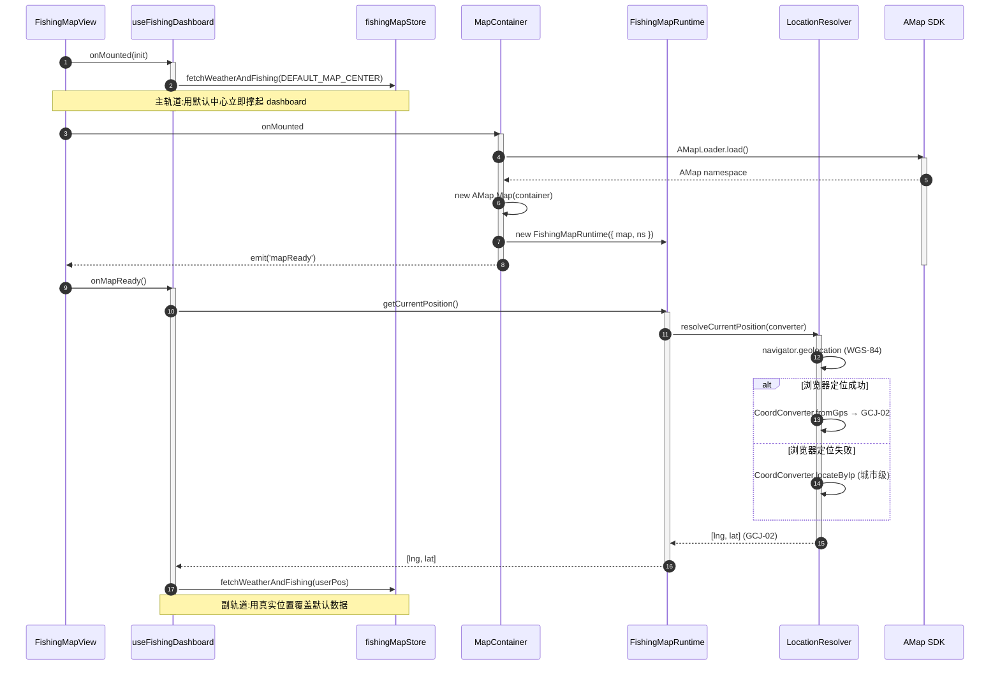
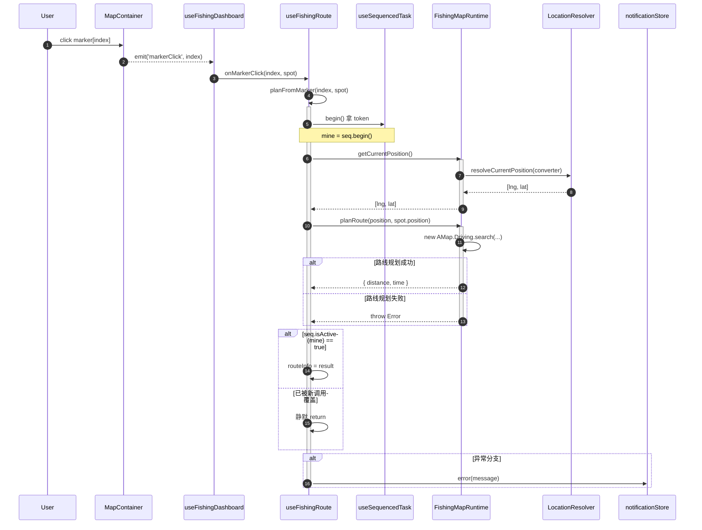
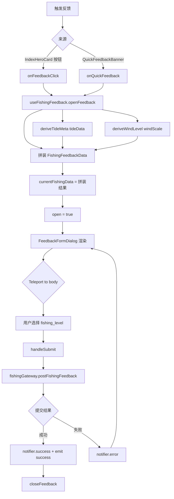
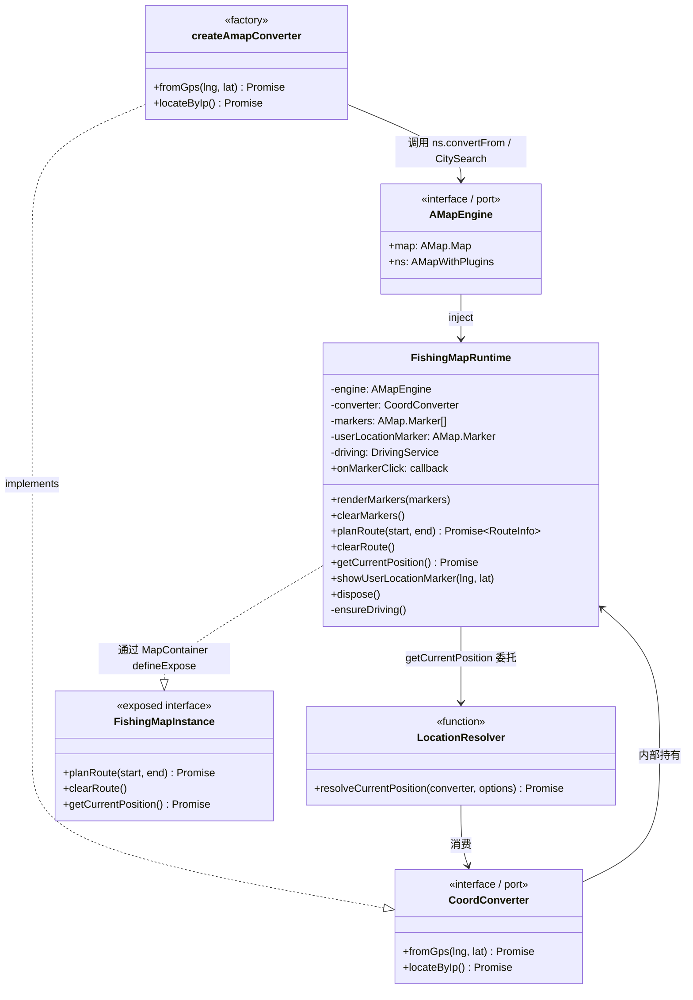
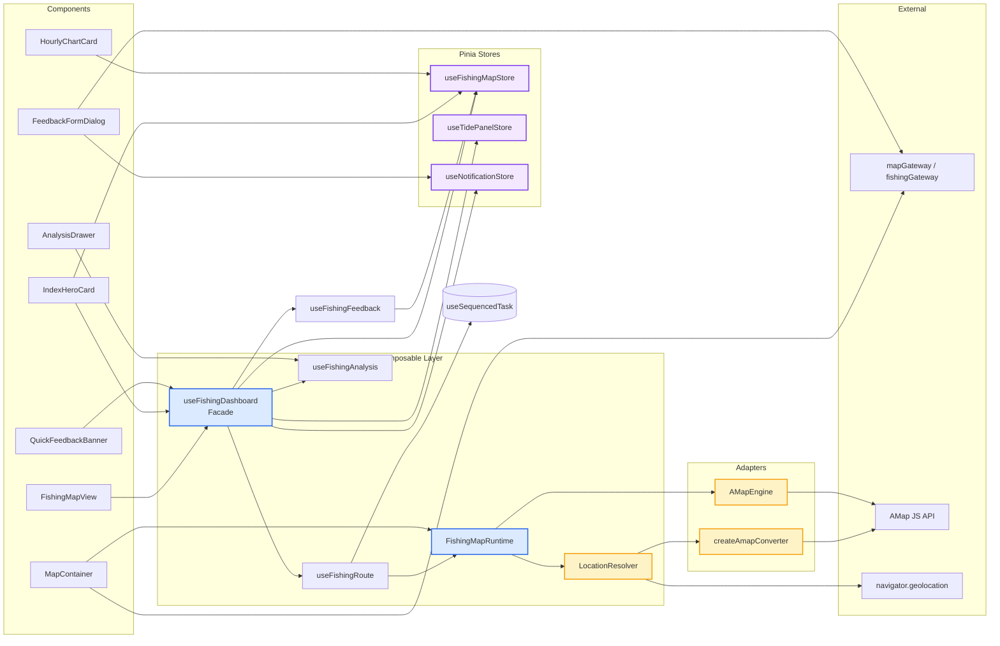

# ADR-0002: Fishing Frontend Architecture

## Status

Accepted

## Context

`frontend/src/views/fishing/` 是 ReadingList 中最复杂的前端模块之一 —— 实时天气 / 潮汐 / 钓点地图 / AI 分析 / 反馈表单 5 类数据汇合在单页 Dashboard,代码量约 2150 行、16 个文件。

该模块在迭代中累积了若干已稳定下来的架构决策(近期完成 `MapContainer` 重构、行为下沉到 runtime + 端口注入),需要一份文档:

1. 给新成员快速建立心智模型
2. 记录"为什么这么写"的设计理由,防止后续被错误"简化"
3. 沉淀可复用的模式(浅组件 / 深模块 / 端口与适配器 / 异步竞态守卫)给其他模块参考

## Decision

采用以下五条核心架构决策:

### 1. 三层结构:View → Composable → Store/Service

- **View Layer** (`FishingMapView.vue`): 只负责 layout 编排(12/6/1 列 grid),0 行业务逻辑
- **Composable Layer**: 状态聚合 + 行为封装,顶层 `useFishingDashboard` 作为 Facade 编排 3 个子 composable + 1 个 runtime
- **Store/Service Layer**: Pinia store 持有跨组件状态;gateway 处理 HTTP

### 2. 深模块 / 浅组件 (Map 重构)

`MapContainer.vue` 重构前在组件内同时管 5 类行为(标记 / 路线 / 定位 / 反编码 / 打点),既管 DOM 又管业务,无法单测。

重构后:

- `MapContainer.vue` 退化为浅组件,只管 DOM 容器、AMap SDK 加载、map 实例生命周期
- 所有行为下沉到 `fishingMapRuntime.ts` 的 `FishingMapRuntime` 类
- 通过 `AMapEngine` 端口注入 `{ map, ns }`,生产用真实 AMap,测试可注入 in-memory 引擎

### 3. 端口与适配器 (Hexagonal)

`locationResolver.ts` 定义 `CoordConverter` 端口:

- `fromGps(lng, lat)`: WGS-84 → GCJ-02
- `locateByIp()`: IP 兜底定位

生产 adapter 由 AMap `convertFrom` / `CitySearch` 实现,测试可注入 in-memory adapter。

### 4. 异步竞态守卫 (useSequencedTask)

`useFishingRoute` 用 `@/composables/useSequencedTask` 防止快速连点 marker 时的状态错乱:

```ts
const mine = seq.begin();
const result = await map.planRoute(position, spot.position);
if (!seq.isActive(mine)) return; // 已被新调用覆盖,静默
routeInfo.value = result;
```

### 5. 共享 Chrome 抽象 (DashboardCard)

所有 tile 共享 `DashboardCard` 包装,统一 `bg-paper / border-border` 语义 token,`tone='hero' | 'default'` 决定视觉档位,motion-v 接管 GPU 动画。

## Consequences

### 正面

- View 层 165 行,几乎全是模板,"瘦 view"信号明确
- `FishingMapRuntime` 可独立单测(注入 mock engine)
- `CoordConverter` 可独立单测
- 新增业务子模块只需在 `useFishingDashboard` 注册一次,即可被 view 通过 `dash.xxx` 访问

### 成本

- 嵌套较深(`useFishingDashboard` → `useFishingRoute` → `MapContainer` ref → `runtime`),新人需花时间理解调用链
- `FishingMapInstance` 接口需要手动 `defineExpose` 保持类型同步
- 端口/适配器模式带来一定样板代码

### 适用范围

本 ADR 确立的模式(深模块 / 浅组件 / 端口与适配器 / 异步竞态守卫)适用于其他含复杂异步 + 第三方 SDK 的模块(如后续可能接入的图表 / 编辑器模块)。

## 模块概览

```
fishing/
├── FishingMapView.vue              165 行  ·  顶层 page,只负责 layout 编排
├── composables/                    7 文件,755 行  ·  状态聚合 + 行为封装
│   ├── useFishingDashboard.ts      113 行  ·  顶层 orchestrator (Facade)
│   ├── useFishingRoute.ts           83 行  ·  路线规划(竞态守卫)
│   ├── useFishingFeedback.ts       120 行  ·  反馈表单数据拼装
│   ├── useFishingAnalysis.ts        62 行  ·  AI drawer payload
│   ├── fishingMapRuntime.ts        226 行  ·  地图行为深模块(纯逻辑)
│   ├── locationResolver.ts          98 行  ·  定位 + 坐标转换(端口)
│   └── amapTypes.ts                 53 行  ·  AMap 插件类型 + global 声明
└── components/                     8 文件,1230 行  ·  纯展示/容器组件
    ├── DashboardCard.vue           171 行  ·  共享 chrome wrapper(motion-v)
    ├── DashboardHeader.vue         56 行  ·  sticky header + AI 入口
    ├── MapContainer.vue            322 行  ·  地图浅组件(仅 DOM + SDK 加载)
    ├── IndexHeroCard.vue           185 行  ·  钓鱼指数主视觉
    ├── HourlyChartCard.vue         221 行  ·  ECharts 24h 降水+温度
    ├── QuickFeedbackBanner.vue     48 行  ·  dashboard 顶部反馈条
    ├── FeedbackFormDialog.vue     147 行  ·  反馈弹窗
    └── AnalysisDrawer.vue          80 行  ·  AI 分析右侧抽屉
```

## 三层架构

```
┌─────────────────────────────────────────────────────────────┐
│  View Layer (FishingMapView.vue)                            │
│  - 12 列 grid 布局 (lg) / 6 列 (md) / 单列 (mobile)         │
│  - 只编排,不持有业务状态                                     │
└──────────────────────┬──────────────────────────────────────┘
                       │ 唯一数据源:useFishingDashboard()
                       ▼
┌─────────────────────────────────────────────────────────────┐
│  Composable Layer (orchestrators + runtimes)                │
│  ┌─────────────────────────────────────────────────────┐    │
│  │ useFishingDashboard  (顶层 orchestrator)            │    │
│  │  ├─ useFishingRoute     (路线 + 竞态)               │    │
│  │  ├─ useFishingFeedback   (反馈数据拼装)              │    │
│  │  ├─ useFishingAnalysis   (AI drawer 状态)           │    │
│  │  └─ FishingMapRuntime    (地图行为)                │    │
│  │       └─ LocationResolver  (定位 + 端口注入)         │    │
│  └─────────────────────────────────────────────────────┘    │
└──────────────────────┬──────────────────────────────────────┘
                       │
                       ▼
┌─────────────────────────────────────────────────────────────┐
│  Store Layer (Pinia) + External Services                    │
│  - useFishingMapStore  (indexData / liveWeather / tide / ...)│
│  - useTidePanelStore   (panelTideSpotName)                  │
│  - useNotificationStore(toast)                              │
│  - mapGateway / fishingGateway (HTTP)                       │
└─────────────────────────────────────────────────────────────┘
```

## 数据流

### 启动序列(双轨兜底)



**意图**: 即使用户定位耗时 3-5 秒,UI 也不会白屏 —— 默认中心先填一次,真实数据就绪后覆盖。

### 标记点击 → 路线规划(带竞态守卫)



**关键点**: 快速连点多个 marker 时,旧请求 `resolve` 时 token 已失效,`seq.isActive(mine)` 返回 false,旧结果不写入 state。

### 反馈数据拼装与提交



### 地图行为深模块内部(FishingMapRuntime)



### 顶层数据流总览



## 外部依赖矩阵

| 来源                             | 用途                                                                  |
| -------------------------------- | --------------------------------------------------------------------- |
| `@amap/amap-jsapi-loader`        | AMap SDK 动态加载                                                     |
| `vue-echarts` + ECharts 6        | HourlyChartCard 双轴图(降水柱+温度线)                                 |
| `motion-v`                       | DashboardCard whileHover 动画                                         |
| `@lucide/vue`                    | 图标 (FishingRod/Bot/Locate/Loader2/X)                                |
| `@/api/mapGateway`               | 高德安全密钥                                                          |
| `@/api/fishingGateway`           | 提交钓鱼反馈                                                          |
| `@/stores/fishingMap`            | 中心 store:indexData / liveWeather / tide / weatherHourly / forecasts |
| `@/stores/tidePanel`             | 潮汐面板选中状态                                                      |
| `@/stores/notification`          | toast                                                                 |
| `@/composables/useSequencedTask` | 异步竞态守卫                                                          |
| `@/composables/useChartColors`   | ECharts 语义色板                                                      |

## 关键设计原则

| 原则                | 体现                                                                                              |
| ------------------- | ------------------------------------------------------------------------------------------------- |
| **单一数据源**      | 跨子模块共享 `useFishingMapStore`;`useFishingDashboard` 暴露 `route/feedback/analysis` 三块子状态 |
| **关注点分离**      | `FishingMapView.vue` 0 行业务逻辑,只编排;业务全在 composable                                      |
| **深模块 / 浅组件** | `MapContainer` 只管 DOM+SDK 加载;行为全部下沉到 `FishingMapRuntime`(可单测)                       |
| **端口与适配器**    | `CoordConverter` 接口,生产用 AMap,测试可注入 in-memory                                            |
| **模板 ref 解耦**   | `useTemplateRef<FishingMapInstance>` 静态类型化,不再 `as unknown as ...`                          |
| **响应式布局**      | 12/6/1 列 grid,移动端 Index 优先,无 JS 即可用                                                     |

## 视觉布局

```
┌──────────────────────────────────────────────────────────────┐
│  DashboardHeader (sticky)                  [AI 分析] 🔔       │
│  钓鱼地图 · ka·no·ci·fer                                       │
├──────────────────────────────────────────────────────────────┤
│  QuickFeedbackBanner  (无 routeInfo 时显示)                    │
│  "钓完了？告诉我们今天实际如何"                       [反馈]    │
├──────────────────────────────────────────────────────────────┤
│                                          │                    │
│           MapContainer                  │   IndexHeroCard   │
│         (主舞台 · 钓点)                  │   (钓鱼指数)       │
│              8/12 col                   │     4/12 col      │
│                                          │                    │
│  ┌──────────┬─────────────────┬───────┴──────┐              │
│  │ Weather  │   HourlyChart   │    Tide      │              │
│  │  3/12    │     5/12        │    4/12      │              │
│  └──────────┴─────────────────┴──────────────┘              │
│                                                              │
│  "在出钓与阅读之间,留一片安静"                                │
└──────────────────────────────────────────────────────────────┘
```

**响应式**:

- `lg+`: 12 列,Map(8) + Index(4) → 底排 Weather(3)+Hourly(5)+Tide(4)
- `md`: 6 列,Map+Index 同列,底排自适应
- mobile: 单列,Index 优先,Map 居次

**入场动画**: `fishing-dashboard-fade-up` 460ms,每个子项 60ms stagger;`prefers-reduced-motion` 自动关闭。
